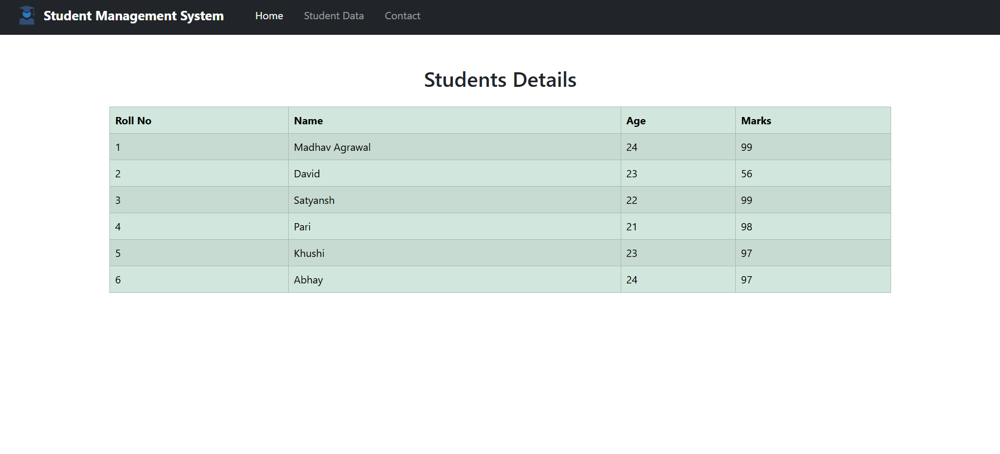
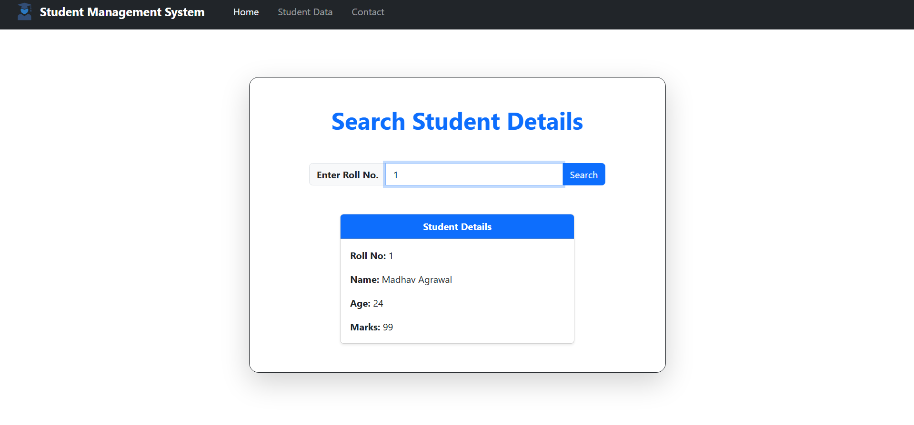
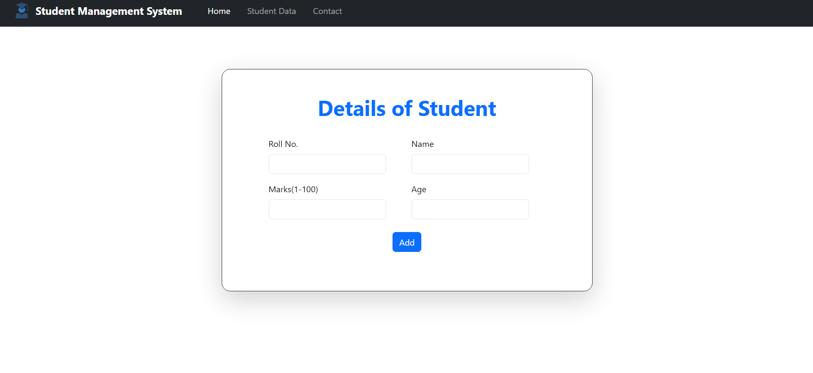
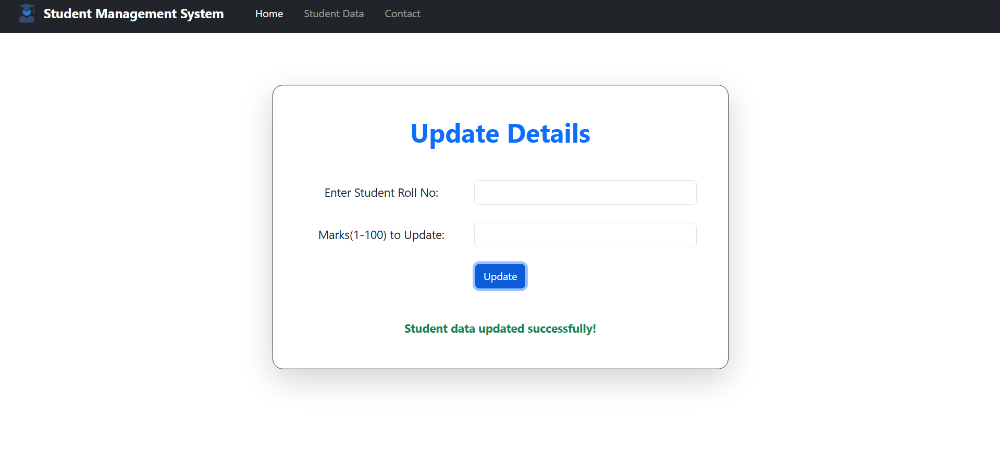
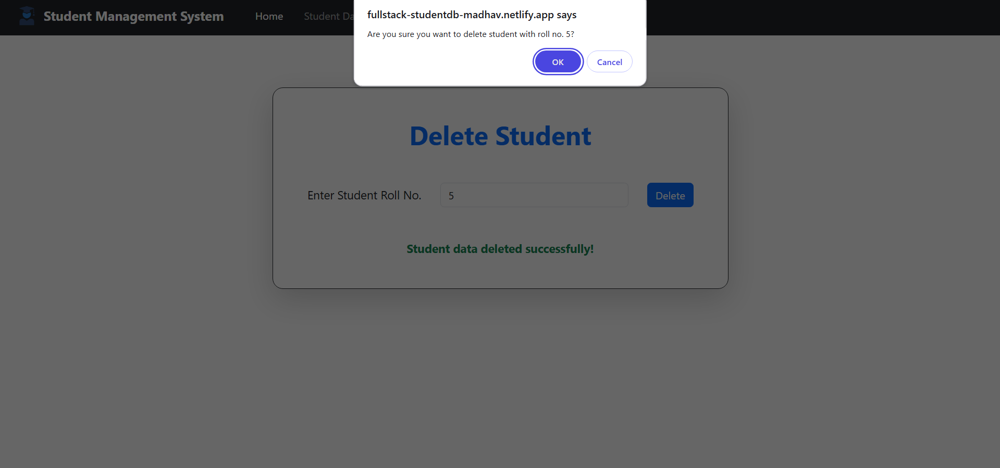

# 🎓 Student Management System – Backend

### **Project Overview**
A RESTful **Student Management System backend** built using **Spring Boot**.  
This application provides APIs for managing student records and connects to a **MySQL** database using **JDBC**. It serves as the backend for the React-based frontend application.

---

## 🚀 Live Links

- **Backend API Base URL:** [https://student-management-system-backend-jssl.onrender.com](https://student-management-system-backend-jssl.onrender.com)  
- **Students Endpoint:** [https://student-management-system-backend-jssl.onrender.com/students](https://student-management-system-backend-jssl.onrender.com/students)  
- **Frontend Live Demo:** [https://fullstack-studentdb-madhav.netlify.app/](https://fullstack-studentdb-madhav.netlify.app/)

---

## ✨ Features

### 🛠️ Core Functionality (CRUD APIs)
- **Create:** Add new student records  
- **Read:** Fetch all students / fetch by Roll no  
- **Update:** Update existing student details  
- **Delete:** Remove student records from database  

### 🔒 Technical Features
- RESTful API design  
- JDBC-based database interaction  
- CORS configuration for frontend integration  
- Exception handling and validation  

---

## 🛠️ Tech Stack

- **Backend Framework:** Spring Boot  
- **Language:** Java  
- **Database:** MySQL  
- **Database Access:** JDBC  
- **Build Tool:** Maven  
- **Deployment:** Render  

---

## 🏗️ System Architecture

- **Client:** React Frontend (Netlify)  
- **Server:** Spring Boot REST API (Render)  
- **Database:** MySQL (Railway)  

---

## ⚡ API Endpoints

| Method | Endpoint                  | Description                     | Request Body Example                                  |
|--------|---------------------------|---------------------------------|-------------------------------------------------------|
| GET    | `/`                       | Displays welcome message        | None                                                  |
| GET    | `/students`               | Get all students                | None                                                  |
| GET    | `/students/{rollno}`      | Get student by rollno           |`{ "Roll no":12}`                                      |
| POST   | `/students`               | Add a new student               |`{ "name": "John", "Roll no":12, "Age":23, "Marks":99 }`|
| PUT    | `/students/{rollno}`      | Update student by rollno        |`{ "name": "John", "Roll no":12, "Age":23, "Marks":76 }`|
| DELETE | `/students/{rollno}`      | Delete student by rollno        |`{ "Roll no":12}`                                      |

---

## 🖼️ Screenshots

You can see the live frontend connected to this backend here:  
[Student Management System – Live Demo](https://fullstack-studentdb-madhav.netlify.app/)

### Example Screenshots

---
   
--- 
 
--- 

---  

---

## ☁️ Deployment on Render

1. Push your project to GitHub.  
2. Connect the repo to **Render**.  
3. Set environment variables for **DB URL, username, and password**.  
4. Deploy to Render and use the generated live backend URL.

---

## 👤 Author

**Madhav Agrawal**  
- Email: agrawalmad00@gmail.com

---

## 📄 License

This project is licensed under the **MIT License**.

---

## 📝 How it Works

1. React frontend sends HTTP requests to the backend.  
2. Backend controllers handle the requests.  
3. DAO layer executes SQL queries via JDBC.  
4. Responses are sent back as JSON to the frontend.

